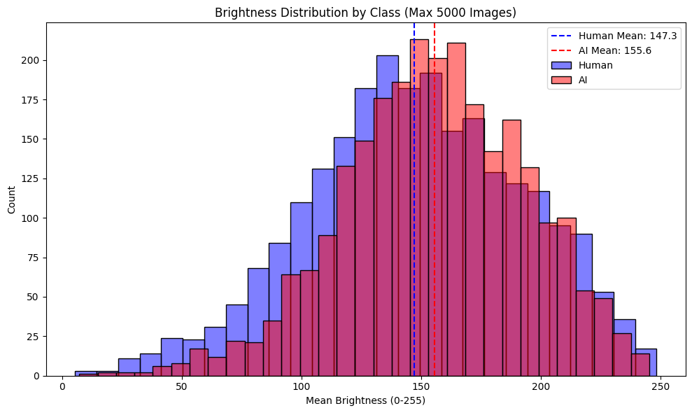
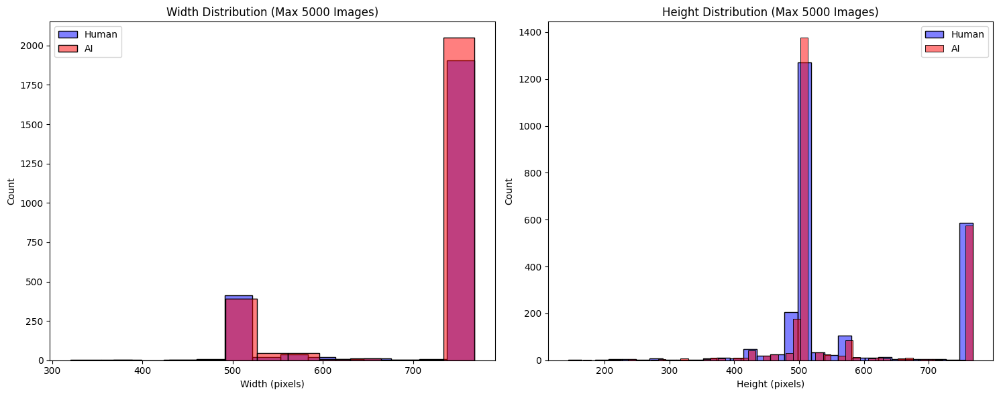
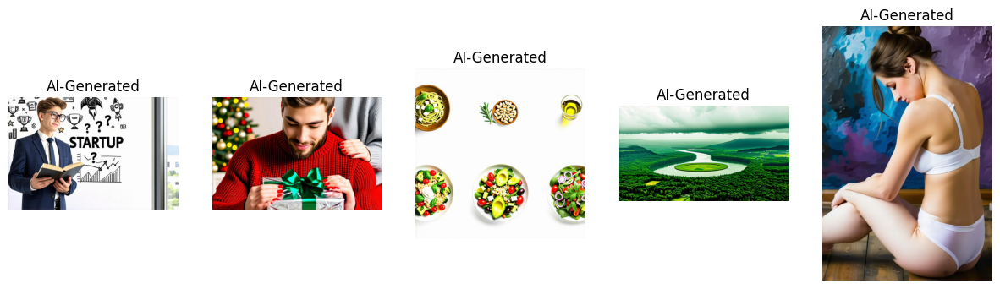
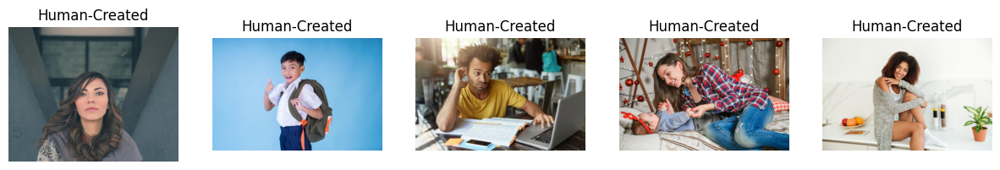
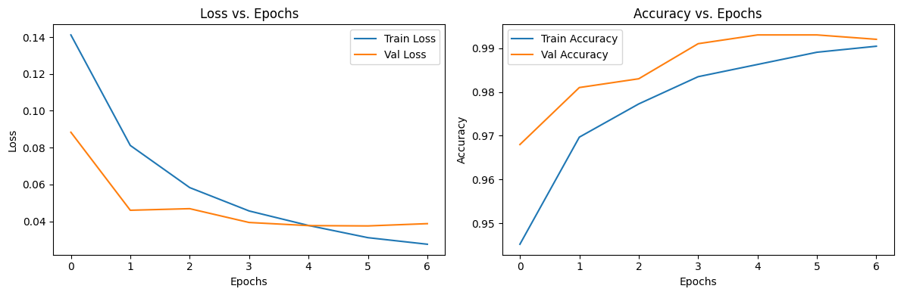
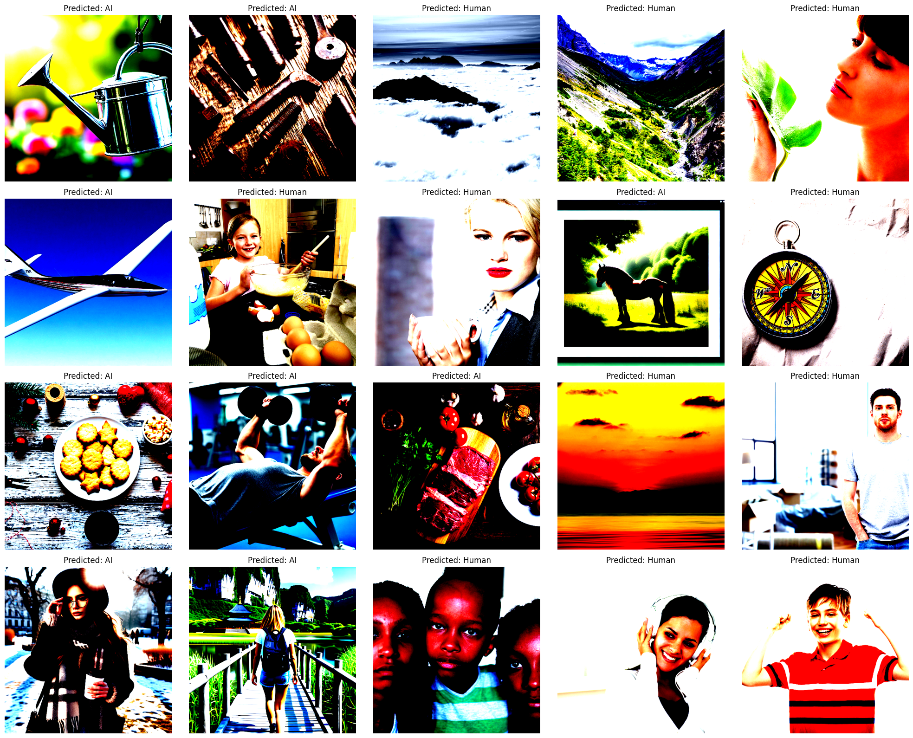

# AI vs Human Image Classifier

## Overview
This project tackles the challenge of distinguishing AI-generated images from human-created ones, a task increasingly critical as generative AI produces realistic content. Using advanced computer vision and deep learning, this solution achieves a competition score of **0.96655**, contributing to media authenticity, digital forensics, and misinformation prevention.

## Dataset
The dataset, provided by Shutterstock and DeepMedia for the "Can You Tell the Difference?" competition, includes:
- **Training set**: 80,000 images
- **Test set**: 5,500 images
- **Classes**: Human-created (0) and AI-generated (1)

Authentic images are sourced from Shutterstock (one-third featuring humans), paired with AI-generated versions from DeepMedia’s cutting-edge models, enabling robust detection.

## Technical Environment

### Hardware
Developed and tested on:
- NVIDIA Tesla P100 GPU (16GB VRAM)
- CUDA 11.2
- 25GB+ RAM recommended

### Software
Implemented in a Jupyter notebook with:
- Python 3.8+
- PyTorch 1.9+
- CUDA-enabled environment (Kaggle/Colab)

## Notebook Contents
The notebook provides a structured approach to the classification task:

1. **Setup and Configuration**
   - Import libraries (PyTorch, torchvision, etc.) and verify versions
   - Configure GPU and optimize memory usage
   - Set hyperparameters and ensure reproducibility with fixed seeds

2. **Data Exploration**
   - Load and analyze dataset statistics
   - Visualize class distribution and sample images
   - Examine image properties:
     - Brightness distribution  
       
     - Width and height distributions  
       
     - Sample images from both classes  
         
       

3. **Data Preprocessing**
   - Apply advanced transformations via `torchvision.v2`:
     - Resize to 512x512 with bicubic interpolation
     - Random flips, crops, color jittering, grayscale, and erasing
     - Gaussian noise and blur for robustness
     - Normalization with ImageNet stats
   - Custom test-time transformations with center cropping
   - Efficient dataset loading and stratified train-validation split (95%/5%)

4. **Model Development**
   - **SimplifiedFIRE Model**: Adapted from the [FIRE model](https://github.com/Chuchad/FIRE/tree/main), featuring:
     - ResNet18 backbone (pretrained on ImageNet)
     - Frequency filtering (`FrequencyFilter`) for mid-frequency features (radius 30-100)
     - 6-channel input (3 RGB + 3 frequency)
     - Modified conv1 layer and binary classification head (2 outputs)
   - Adam optimizer and step-decay learning rate scheduling

5. **Model Training**
   - Training loop with:
     - Mixed precision training for GPU efficiency
     - Batch and epoch-level progress tracking
     - Loss/accuracy visualization (sub-images: Accuracy vs Epochs and Loss vs Epochs)  
       
     - Checkpointing based on validation performance

6. **Inference and Submission**
   - Generate predictions with test-time transforms
   - Visualize sample predictions with confidence scores:  
     
   - Format submission file for competition

## Performance Optimization
- **Memory**: Optimized batch sizing for P100 GPU
- **Parallelism**: Multiprocessing for preprocessing
- **CUDA**: Tuned for efficient GPU utilization

## Results
The `SimplifiedFIRE` model achieves:
- **Competition Score**: 0.96655
- Training metrics (tracked in notebook):
  - **Training Accuracy**: 0.9895
  - **Validation Accuracy**: 0.9902

Visualizations of predictions and training progress are included (see above).

## How to Use

### Requirements
Install dependencies from `requirements.txt`:
```
torch>=1.9.0
torchvision>=0.10.0
numpy>=1.20.0
pandas>=1.3.0
pillow>=8.3.1
matplotlib>=3.4.3
seaborn>=0.11.2
scikit-learn>=0.24.2
tqdm>=4.62.2
```

### Running the Notebook
1. Upload to a GPU-enabled platform (Kaggle/Colab recommended)
2. Install dependencies:
   ```
   !pip install -r requirements.txt
   ```
3. Ensure dataset access
4. Run cells sequentially
5. Modify test data path for custom inference

### Dataset Access
Available at: [https://www.kaggle.com/datasets/alessandrasala79/ai-vs-human-generated-dataset](https://www.kaggle.com/datasets/alessandrasala79/ai-vs-human-generated-dataset)

## Competition
Developed for the "Can You Tell the Difference?" competition by Women in AI, focusing on accurate classification of AI-generated vs. human-created images. Details: [https://www.womeninai.co/kagglechallenge2025](https://www.womeninai.co/kagglechallenge2025)

## Future Improvements
- Explore ensemble models with additional architectures
- Refine frequency-based feature extraction
- Add explainability to identify AI-specific patterns
- Test robustness against advanced generative methods

## Acknowledgements
- Shutterstock and DeepMedia for the dataset
- Women in AI for hosting the competition
- NVIDIA for GPU resources
- [FIRE model](https://github.com/Chuchad/FIRE/tree/main) for inspiration and baseline architecture
